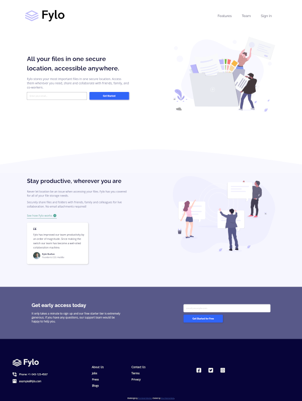
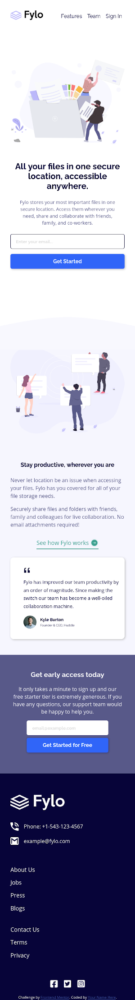

# Frontend Mentor - Fylo landing page with two column layout solution

This is a solution to the [Fylo landing page with two column layout challenge on Frontend Mentor](https://www.frontendmentor.io/challenges/fylo-landing-page-with-two-column-layout-5ca5ef041e82137ec91a50f5). Frontend Mentor challenges help you improve your coding skills by building realistic projects.

### The challenge

Users should be able to:

-   View the optimal layout for the site depending on their device's screen size
-   See hover states for all interactive elements on the page

### Screenshot

-   Desktop Version



-   Mobile Version



### Links

-   [Live site URL here](https://tathanhdat.github.io/Fylo-landing-page-with-two-column-layout/)

## My process

### Built with

-   Semantic HTML5 markup
-   CSS custom properties
-   Flexbox
-   CSS Grid
-   Mobile-first workflow

### What I learned

-   How to create a warning message when click on submit button.

```html
<form class="submit">
    <input type="button" value="Get Started" />
    <input type="email" placeholder="Enter your email..." />
    <p class="warn-msg">Please check your email</p>
</form>
```

```css
.submit input[type='email'] {
    order: 1;
    font-weight: 700;
    height: 45px;
    padding: 1rem;
    margin-bottom: 1rem;
    border: 1px solid var(--very-dark-blue);
    border-radius: 5px;
    color: var(--light-gray);
}

.submit input[type='email']:focus-visible {
    outline-style: none;
}

.submit input[type='button'] {
    order: 3;
    height: 45px;
    text-align: center;
    border: transparent;
    border-radius: 5px;
    background-color: var(--bright-blue);
    color: white;
    font-weight: 700;
    font-size: 1rem;
    box-shadow: 2px 2px 6px var(--light-gray);
    cursor: pointer;
}

.submit input[type='button']:hover {
    background-color: hsl(224, 93%, 70%);
}

.warn-msg {
    order: 2;
    position: relative;
    color: hsla(0, 100%, 50%, 0.7);
    top: -15px;
    left: 0;
    max-width: 180px;
    display: none;
}

input[type='button']:active ~ .warn-msg {
    display: block;
}

input[type='button']:active ~ input[type='email'] {
    border-color: hsla(0, 100%, 50%, 0.5);
}
```

## Author

-   Facebook - [Ta Thanh Dat](https://www.facebook.com/tathanh.dat.5/)
-   Frontend Mentor - [@Ta Thanh Dat](https://www.frontendmentor.io/profile/tathanhdat)
